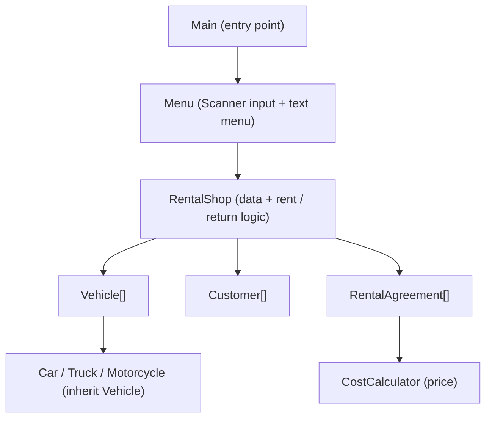
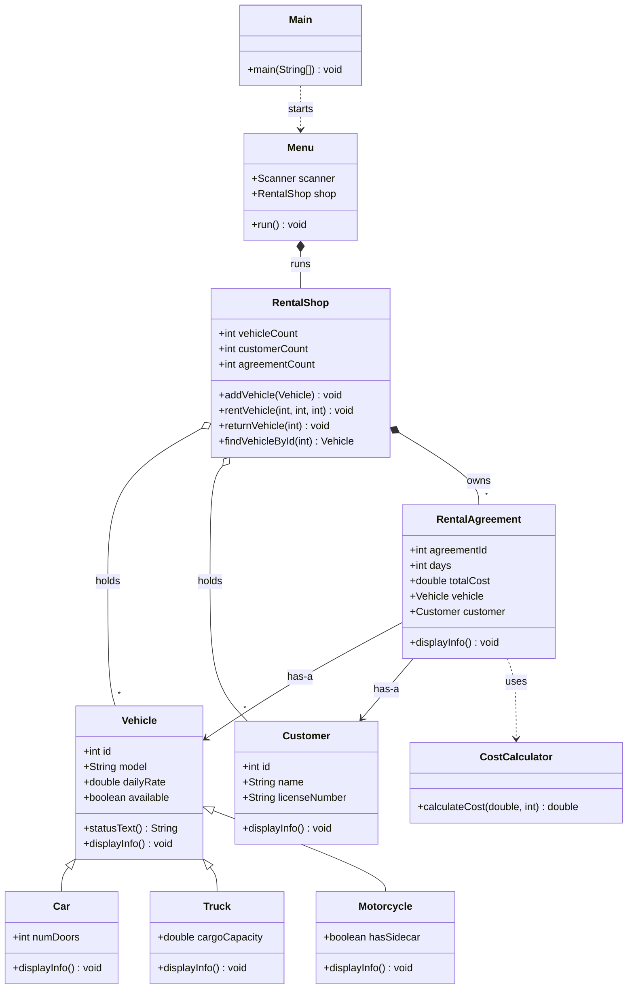
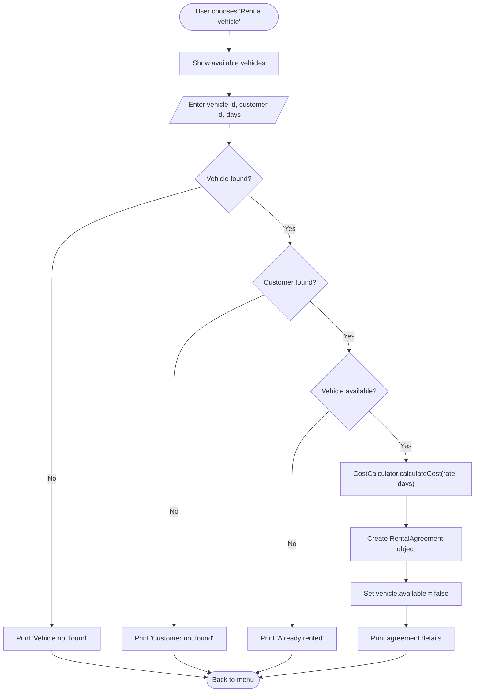

# Vehicle Rental System

**Java Bonus Task** · Idea 6
**Amaan Nizam** · Student ID 4024096 · Presentation 03.07.2026

> GitHub renders the diagrams below automatically inside ```mermaid``` blocks. No export needed. mermaid.live is only for turning a diagram into a PNG if you want it on PowerPoint slides.

---

## 1. Scope and Requirements

**What it does:** a console application to manage a small vehicle rental shop.

- Show all vehicles or only available ones.
- Register customers and list them.
- Rent a vehicle to a customer for N days (price calculated automatically, 10% discount for 7+ days).
- Return a vehicle.
- View all rental agreements.

**Out of scope (intentional):**

- No graphical interface (terminal output, allowed by the task).
- Data held in memory for one run (no file or database).
- Fixed capacity (arrays of 100), demo run with valid input.

**Compliance:** 9 classes excluding Main, 6 relationships plus polymorphism, terminal demo, compiles and runs on JDK 21.

---

## 2. Architecture



**Control flow:** Main starts Menu. Menu reads the choice with a Scanner and calls the matching RentalShop method. RentalShop works on its arrays and prints the result.

---

## 3. UML Class Diagram



Note: `CostCalculator.calculateCost` and `Main.main` are static (called on the class, no object needed).

---

## 4. Object-Oriented Relationships

| Relationship | Type | Meaning |
|--------------|------|---------|
| Car / Truck / Motorcycle extend Vehicle | Inheritance | A car is a vehicle. |
| RentalAgreement holds Vehicle | Association (has-a) | An agreement has a vehicle. |
| RentalAgreement holds Customer | Association (has-a) | An agreement has a customer. |
| RentalAgreement uses CostCalculator | Dependency (uses) | Asks it for the price. |
| RentalShop holds arrays of all three | Aggregation (has-many) | The shop has many of each. |
| Menu owns RentalShop | Composition | The menu drives the shop. |

Requirement is 4. Project has 6, plus polymorphism.

---

## 5. Use Case: Rent a Vehicle



**Trace:** VW-Golf at 45 EUR/day for 7 days = 45 * 7 = 315, minus 10% = 283.5. Yamaha at 35 EUR/day for 3 days = 105 (no discount, under 7 days).

---

## 6. Live Demo Script

Run `javac *.java` then `java Main`, and enter in order:

1. `1` show available vehicles (5 vehicles, each printed in its own format, this is polymorphism).
2. `5` then `1`, `100`, `7` rent VW-Golf for 7 days, price 283.5 (discount).
3. `3` then `200`, `Krisha`, `DL-99` register a new customer.
4. `5` then `4`, `200`, `3` rent Yamaha for 3 days, price 105 (no discount).
5. `7` show both agreements.
6. `6` then `1` return VW-Golf.
7. `2` show all vehicles (Golf available again, Yamaha still rented).
8. `0` exit.

---

## 7. Key Concepts Demonstrated

- **Classes and objects:** 10 classes, objects created with `new`.
- **Inheritance and super:** three vehicle subclasses reuse Vehicle fields.
- **Polymorphism:** one `displayInfo()` call, three different outputs.
- **Static vs non-static:** CostCalculator is static, displayInfo is not.
- **Arrays and loops:** storage and linear search in RentalShop.
- **Encapsulated logic:** pricing rule isolated in CostCalculator.
- **Scanner input, if/else, modulo, string concatenation.**

---

## 8. Defense Notes

- Vehicle is not abstract because abstract classes were not in the course. It is never created directly; every vehicle is a Car, Truck, or Motorcycle.
- Each subclass overrides `displayInfo()`. This is one step beyond the lecture examples (which only add new methods), used here for cleaner code.
- A vehicle cannot be rented twice: `available` becomes false on rent and true only on return; `rentVehicle` checks it.
