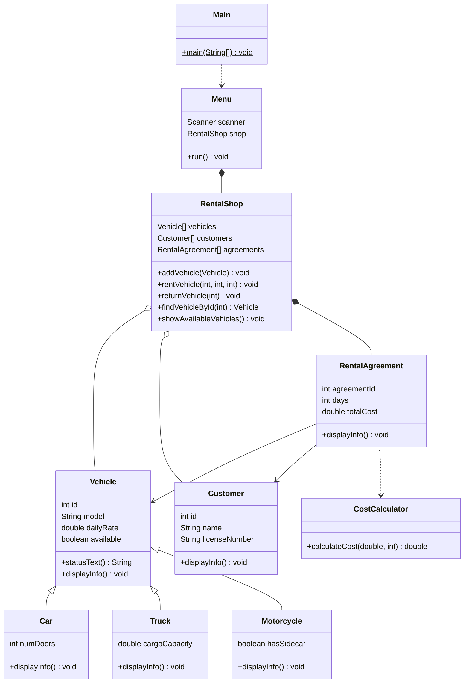
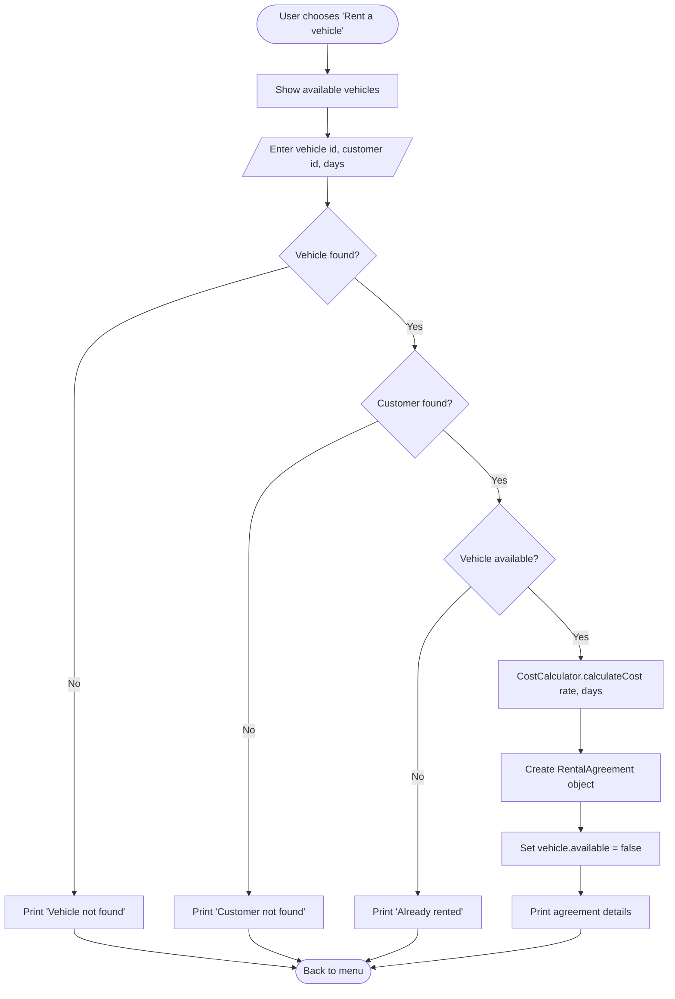

# Vehicle Rental System — Project Documentation

**Course:** Java (THWS) · **Bonus Task** · Project Idea #6 — Vehicle Rental System
**Type:** Individual · **Demo date:** 03.07.2026 · **Interface:** Terminal (console)

---

## 1. Scope and Requirements

### What the application does
A console application that manages a small vehicle rental service. A user can browse
available vehicles, register customers, rent a vehicle for a number of days, return it,
and view all rental agreements. The rental price is calculated automatically, including
a discount for long rentals.

### Functional requirements
- Store three kinds of vehicles: cars, trucks and motorcycles.
- Show all vehicles or only the currently available ones.
- Register customers and list them.
- Rent a vehicle to a customer for N days, which:
  - checks the vehicle and customer exist,
  - checks the vehicle is free,
  - calculates the total price,
  - marks the vehicle as rented,
  - creates a rental agreement.
- Return a vehicle, marking it available again.
- List all rental agreements with customer, vehicle, days and price.

### Pricing rule
`total = dailyRate * days`. Rentals of **7 days or more get a 10% discount**.

### Scope limits (intentionally out of scope)
- No graphical user interface (terminal output only, which the task allows).
- Data lives in memory for one program run; nothing is saved to a file or database.
- Fixed capacity of 100 vehicles / 100 customers / 100 agreements (simple arrays).
- The demo is run with valid input, as required by the task (no runtime error handling).

---

## 2. Architecture / Pipeline

```
Main
 └─ creates Menu
      └─ owns RentalShop          (all data + logic)
           ├─ Vehicle[]  ── Car / Truck / Motorcycle   (inheritance)
           ├─ Customer[]
           └─ RentalAgreement[]   ── links Vehicle + Customer
                                     └─ uses CostCalculator (price)
```

**Flow of control:** `Main` starts `Menu`. `Menu` reads the user's choice with a
`Scanner` and calls the matching method on `RentalShop`. `RentalShop` performs the
operation on its arrays of domain objects and prints the result.

---

## 3. Classes

Total: **9 classes + 1 Main class** (requirement: at least 8 excluding Main → met).

| # | Class | Responsibility |
|---|-------|----------------|
| 1 | `Vehicle` | Base class. Common fields (id, model, dailyRate, available) and shared methods. |
| 2 | `Car` | A vehicle with `numDoors`. Extends `Vehicle`. |
| 3 | `Truck` | A vehicle with `cargoCapacity`. Extends `Vehicle`. |
| 4 | `Motorcycle` | A vehicle with `hasSidecar`. Extends `Vehicle`. |
| 5 | `Customer` | A person who rents vehicles (id, name, license number). |
| 6 | `RentalAgreement` | One rental: links a `Vehicle` and a `Customer`, stores days and total cost. |
| 7 | `CostCalculator` | Static helper that calculates the rental price (with discount). |
| 8 | `RentalShop` | The manager. Holds the arrays and contains the rent/return/search/list logic. |
| 9 | `Menu` | Console user interface. Reads input and calls `RentalShop`. |
| — | `Main` | Entry point. Starts the `Menu`. |

---

## 4. Object-Oriented Relationships

Requirement: at least 4 clear relationships. **This project has 11.**

| Relationship | Type | Where in code |
|--------------|------|---------------|
| `Car` extends `Vehicle` | Inheritance | `class Car extends Vehicle` |
| `Truck` extends `Vehicle` | Inheritance | `class Truck extends Vehicle` |
| `Motorcycle` extends `Vehicle` | Inheritance | `class Motorcycle extends Vehicle` |
| `RentalAgreement` holds a `Vehicle` | Association (has-a) | field `Vehicle vehicle` |
| `RentalAgreement` holds a `Customer` | Association (has-a) | field `Customer customer` |
| `RentalAgreement` uses `CostCalculator` | Dependency (uses) | calls `CostCalculator.calculateCost(...)` |
| `RentalShop` holds `Vehicle[]` | Aggregation | field `Vehicle[] vehicles` |
| `RentalShop` holds `Customer[]` | Aggregation | field `Customer[] customers` |
| `RentalShop` owns `RentalAgreement[]` | Composition | creates and stores agreements |
| `Menu` owns a `RentalShop` | Composition | field `RentalShop shop` |
| `Main` uses `Menu` | Dependency | creates and starts it |

**Polymorphism** is also demonstrated: `RentalShop` calls `vehicles[i].displayInfo()`
on a `Vehicle` reference, and Java automatically runs the `Car`, `Truck` or
`Motorcycle` version depending on the real object type.

---

## 5. UML Class Diagram

> Source file: `diagram_class.mmd`. To turn it into an image for slides, paste the
> contents into https://mermaid.live and export as PNG/SVG.



---

## 6. Use Case Flowchart — "Rent a Vehicle"

> Source file: `diagram_rent_flowchart.mmd` (also exportable at mermaid.live).



---

## 7. How to Compile and Run

All files are in the default package. From inside the project folder:

```bash
javac *.java        # compiles all classes
java Main           # starts the program
```

Requires Java 21 (or any recent JDK). The program is menu-driven; type the number of
the option and press Enter.

---

## 8. Suggested Live Demo Script (≈ 3 minutes)

Run these inputs in order to show every feature, including the discount:

1. `1` → show available vehicles (5 vehicles, each printed in its own format).
2. `5` then `1`, `100`, `7` → rent the VW-Golf to customer 100 for 7 days.
   Price = 45 × 7 = 315 → **283.5** (the 10% long-rental discount).
3. `3` then `200`, `Krisha`, `DL-99` → register a new customer.
4. `5` then `4`, `200`, `3` → rent the Yamaha to customer 200 for 3 days.
   Price = 35 × 3 = **105** (no discount, under 7 days).
5. `7` → show both agreements.
6. `6` then `1` → return the VW-Golf.
7. `2` → show all vehicles (Golf is `Available` again, Yamaha is still `Rented`).
8. `0` → exit.

Talking points while it runs:
- Step 1 proves **polymorphism** (one method call, three different outputs).
- Step 2 vs Step 4 proves the **CostCalculator** discount logic.
- Steps 2/6/7 prove the **object state** (`available`) and the **agreement objects**.

---

## 9. Evaluation Defense — Likely Questions and Answers

**Q: Why is `Vehicle` not an abstract class?**
A: Abstract classes were not part of the course, so I used a normal base class and
simply never create a plain `Vehicle` directly. Every vehicle is created as a `Car`,
`Truck`, or `Motorcycle`. The base class still gives me shared fields and the shared
`statusText()` method.

**Q: What is the difference between a static and a non-static method here?**
A: `CostCalculator.calculateCost(...)` is static, so I call it on the class without an
object, because it only needs numbers in and a number out. `displayInfo()` is
non-static, because it prints data that belongs to one specific object.

**Q: Show me an example of inheritance and what `super` does.**
A: `Car extends Vehicle`. In the `Car` constructor, `super(id, model, dailyRate)` calls
the `Vehicle` constructor to set the shared fields, then `Car` sets its own `numDoors`.

**Q: How does `vehicles[i].displayInfo()` know which version to run?**
A: The array holds `Vehicle` references, but each slot actually points to a `Car`,
`Truck` or `Motorcycle` object. Java picks the method of the real object at run time.
That is polymorphism.

**Q: Why arrays and not a list?**
A: The course covered arrays. I use a fixed-size array plus a counter variable
(`vehicleCount`) that tracks how many slots are filled, so I never read empty slots.

**Q: What happens if the user rents a vehicle that is already rented?**
A: `rentVehicle` checks `if (!v.available)` and prints "Vehicle is already rented."
without creating an agreement. I also check the vehicle id and customer id exist first.

**Q: Where is the "has-a" relationship?**
A: `RentalAgreement` has a `Vehicle` field and a `Customer` field — one agreement
contains references to those two objects. `RentalShop` has arrays of all three types.

**Q: Could two agreements point to the same vehicle?**
A: Not at the same time. When a vehicle is rented its `available` flag becomes false,
so it cannot be rented again until it is returned.

---

## 10. File List

| File | Purpose |
|------|---------|
| `Main.java` | Entry point |
| `Menu.java` | Console interface (Scanner loop) |
| `RentalShop.java` | Data + core logic |
| `Vehicle.java` | Base class |
| `Car.java`, `Truck.java`, `Motorcycle.java` | Subclasses |
| `Customer.java` | Customer data |
| `RentalAgreement.java` | One rental record |
| `CostCalculator.java` | Price calculation |
| `diagram_class.mmd` | UML class diagram source |
| `diagram_rent_flowchart.mmd` | Use case flowchart source |
| `PROJECT_DOCUMENTATION.md` | This document |
