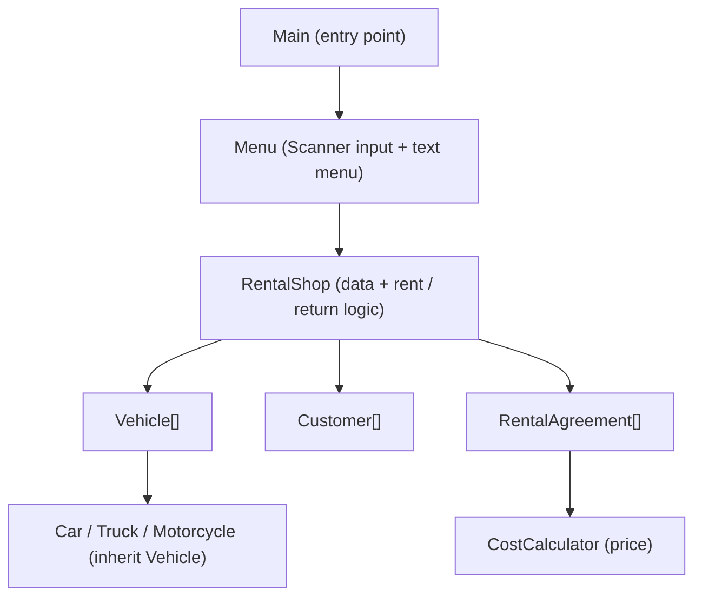
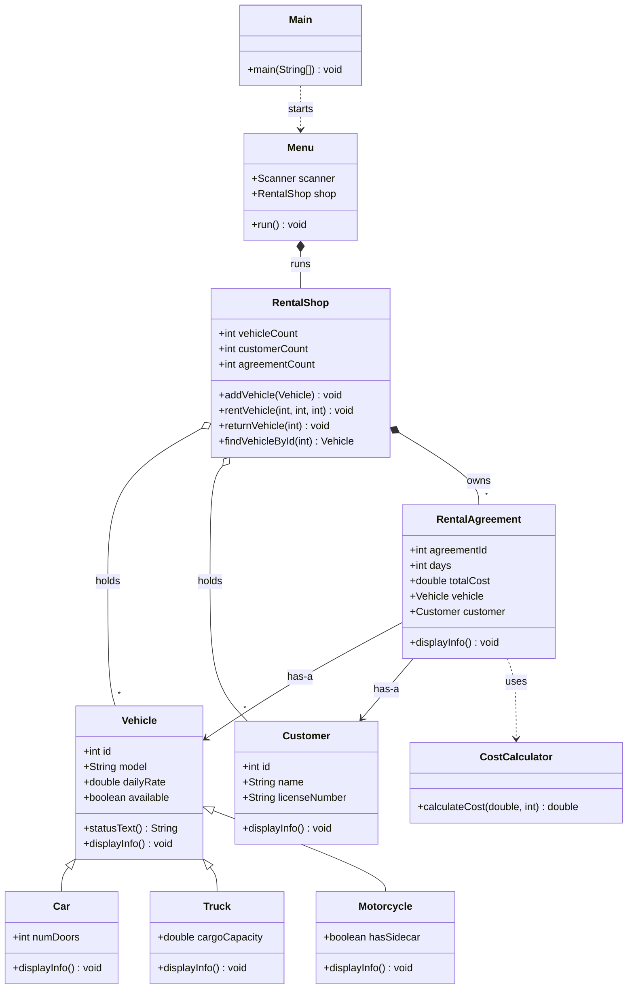
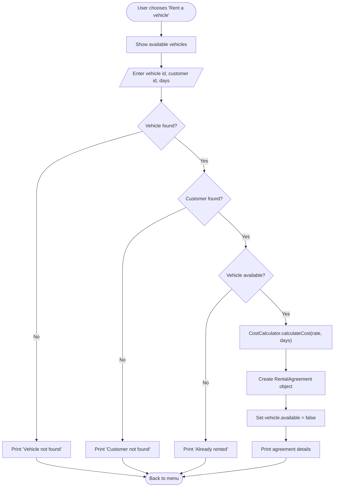

# Vehicle rental system

Java bonus task, project idea 6. Amaan Nizam, student ID 4024096. Presentation on 03.07.2026.

## What it does

A console program for a small vehicle rental shop. From a text menu you can:

- list all vehicles, or only the ones that are free,
- register customers and list them,
- rent a vehicle to a customer for a number of days,
- return a vehicle,
- see all rental agreements.

The price is worked out automatically. A rental of seven days or more gets a 10 percent discount.

## Scope

I kept the program to the concepts from the course. A few limits are deliberate:

- No graphical interface. Everything runs in the terminal, which the task allows.
- Data lives in memory for one run. Nothing is written to a file or a database.
- Storage is fixed-size arrays (100 each), which is more than enough for a demo.
- The demo uses valid input, so there is no handling for bad input.

## Classes

The program has nine classes and a Main class.

- Vehicle is the base class. It holds the id, model, daily rate, and whether the vehicle is free, and it prints one vehicle line.
- Car, Truck, and Motorcycle each extend Vehicle and add one field: number of doors, cargo capacity, and whether it has a sidecar. Each one prints its own line so it can show its extra field.
- Customer holds an id, a name, and a licence number.
- RentalAgreement is one rental. It keeps the rented Vehicle and the Customer, the number of days, and the total price.
- CostCalculator works out the price. It is a small helper with one static method.
- RentalShop is the core of the program. It stores the vehicles, customers, and agreements in arrays and does the renting, returning, searching, and listing.
- Menu is the user interface. It reads the menu choice with a Scanner and calls the matching method on RentalShop.
- Main starts the Menu and does nothing else.

## Relationships

The design uses the main object-oriented relationships:

- Inheritance: Car, Truck, and Motorcycle are types of Vehicle.
- Association (has-a): a RentalAgreement holds a Vehicle and a Customer.
- Aggregation: RentalShop holds arrays of vehicles, customers, and agreements.
- Composition: Menu owns the RentalShop it drives.
- Dependency: RentalAgreement calls CostCalculator to get the price.

When RentalShop loops over the vehicles and calls displayInfo(), each object runs its own version, so a car prints its doors and a truck prints its cargo capacity. That is polymorphism.

## Architecture



Main starts the Menu. The Menu reads a choice with a Scanner and calls the right method on RentalShop. RentalShop works on its arrays and prints the result.

## Class diagram



CostCalculator.calculateCost and Main.main are static, so they are called on the class without an object.

## Use case: renting a vehicle



Worked example: a VW Golf at 45 per day for seven days is 45 times 7, which is 315, minus 10 percent, so 283.5. A Yamaha at 35 per day for three days is 105, with no discount because three is under seven.

## How to compile and run

All files sit in one folder. From that folder:

```bash
javac *.java
java Main
```

You need Java 21 or a newer JDK. Pick a menu option by typing its number and pressing Enter.

## Demo walkthrough

Start the program and enter these in order:

1. 1: list the available vehicles. Each type prints in its own format.
2. 5, then 1, 100, 7: rent the VW Golf for seven days. The price comes out as 283.5.
3. 3, then 200, Krisha, DL-99: register a new customer.
4. 5, then 4, 200, 3: rent the Yamaha for three days. The price is 105.
5. 7: show both agreements.
6. 6, then 1: return the VW Golf.
7. 2: list all vehicles. The Golf is free again, the Yamaha is still rented.
8. 0: exit.

## Design notes

A few choices worth explaining:

- I used plain arrays with a counter variable instead of a list, since arrays are what the course covered. The counter tracks how many slots are filled, so the loops never touch empty slots.
- Each vehicle subclass overrides displayInfo() so it can print its own extra field in the vehicle line.
- Vehicle is a normal class, not abstract, because abstract classes were not part of the course. I never create a plain Vehicle. Every vehicle is a Car, a Truck, or a Motorcycle.
- The pricing rule sits in its own CostCalculator class, so it is in one place and easy to change.
- A vehicle cannot be rented twice at once. Renting sets its available flag to false, and it only goes back to true on return. rentVehicle checks that flag before it creates an agreement.
